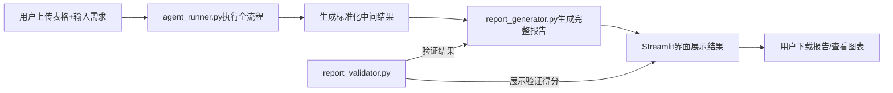

# Huginn 项目 - 成员C技术需求对接文档
**文档版本**：v1.0  
**对接日期**：2026-06-10  
**对接双方**：成员B（智能体流程负责人）→ 成员C（报告生成与展示负责人）  
**前置状态**：成员A+B已完成所有核心后端模块，生成标准化中间结果

---

## 1. 对接概述
### 1.1 项目现状
成员A和B已完成**数据处理、统计分析、LLM决策、主流程串联、合规性验证**全部后端功能，每次运行会在`outputs/`目录下生成标准化的中间结果文件。

### 1.2 成员C核心职责
基于成员A+B输出的标准化中间结果，完成：
1. 完整Markdown报告自动生成
2. Streamlit交互式展示界面开发
3. 报告导出功能（Markdown/PDF/Word）
4. 最终汇报材料准备

### 1.3 整体工作流


---

## 2. 输入输出规范
### 2.1 成员C的输入（标准化，不可修改）
每次运行`agent_runner.py`后，会在`outputs/YYYYMMDD_HHMMSS_文件名/`目录下生成以下文件，成员C**只能基于这些文件生成报告和界面**：

| 文件名 | 来源 | 核心内容 | 用途 |
|--------|------|----------|------|
| `data_profile.json` | data_profiler.py | 数据画像：行数、列数、缺失率、字段类型、各字段统计量 | 报告"数据概况与预处理"章节 |
| `stats_results.json` | analysis_engine.py | 完整统计结果：点估计、区间估计、假设检验、ANOVA、卡方检验、分布检验 | 报告"统计推断分析"章节 |
| `valid_tasks.json` | task_planner.py | 已执行的分析任务列表：问题、变量、方法、业务价值 | 报告"分析方法说明"章节 |
| `findings.json` | llm_client.py | 核心数据发现：结论、证据、方法、重要性 | 报告"主要数据发现"章节 |
| `suggestions.json` | llm_client.py | 课程建议：建议内容、数据依据、改进方向 | 报告"课程改进建议"章节 |
| `charts/*.png` | chart_generator.py | 4类可视化图表：柱状图、箱线图、散点图、热力图 | 报告中插入图表 |
| `validation_result.json` | report_validator.py | 合规性验证结果：得分、各模块检查结果、改进建议 | 报告末尾自检部分，界面展示验证状态 |

### 2.2 成员C的输出
1. **代码交付**：`report_generator.py`、`app.py`、`templates/`目录
2. **产物交付**：可直接运行的Streamlit应用、自动生成的完整课程报告
3. **汇报交付**：项目演示PPT、现场演示脚本

---

## 3. 核心模块技术需求
### 3.1 报告生成器 (`report_generator.py`)
#### 3.1.1 功能要求
- 输入：运行输出目录路径（如`outputs/20260610_143022_课程问卷`）
- 输出：符合课程作业要求的完整Markdown报告
- 自动填充所有章节内容，无需人工干预
- 自动插入所有生成的图表
- 自动集成合规性验证结果

#### 3.1.2 报告结构与内容映射
严格按照课程作业要求的7个章节生成：

| 报告章节 | 内容来源 | 实现要点 |
|----------|----------|----------|
| **1. 数据来源与分析目标** | 用户输入的需求 + 数据画像元信息 | 明确说明数据来自课程问卷，分析目标是为教学改进提供数据支撑 |
| **2. 数据概况与预处理** | `data_profile.json` | 展示行数、列数、字段类型分布、缺失率统计、异常值处理方式 |
| **3. 描述性统计与可视化** | `data_profile.json` + `charts/*.png` | 插入柱状图、箱线图，对主要字段的分布进行描述 |
| **4. 统计推断分析** | `stats_results.json` | 筛选p<0.05的显著结果，每个分析包含方法、变量、统计量、p值、结论 |
| **5. 主要数据发现** | `findings.json` | 按重要性排序，每条发现必须引用具体统计量和p值 |
| **6. 课程改进建议** | `suggestions.json` | 每条建议对应一个数据发现，明确改进方向和预期效果 |
| **7. 局限性说明** | 固定模板 + 验证结果 | 必须包含：相关性≠因果关系、样本量限制、问卷偏差 |
| **附录：合规性验证报告** | `validation_result.json` | 展示总分、各模块得分、通过/不通过状态 |

#### 3.1.3 格式要求
- 使用标准Markdown语法，支持导出为PDF/Word
- 图表使用相对路径引用：``
- 所有统计量保留4位小数，p值保留4位小数
- 显著结果用**加粗**标注
- 章节编号清晰，层级分明

#### 3.1.4 代码接口
```python
# report_generator.py 核心接口
def generate_full_report(run_dir: str, user_requirement: str) -> str:
    """
    生成完整的Markdown报告
    :param run_dir: 运行输出目录路径
    :param user_requirement: 用户输入的分析需求
    :return: 完整的Markdown报告字符串
    """
    # 实现逻辑：
    # 1. 加载所有JSON文件
    # 2. 按报告结构填充内容
    # 3. 插入图表
    # 4. 添加局限性说明和验证结果
    # 5. 返回Markdown字符串
```

### 3.2 Streamlit展示界面 (`app.py`)
#### 3.2.1 功能要求
- 单页应用，简洁易用
- 支持上传Excel/CSV文件
- 支持输入分析需求
- 实时展示运行状态和进度
- 分标签展示所有结果
- 支持下载完整报告和原始数据

#### 3.2.2 页面布局
```
┌─────────────────────────────────────────────────────┐
│  课程问卷分析智能体 Huginn v1.0                    │
├─────────────────────────────────────────────────────┤
│ 1. 文件上传区域                                      │
│    [上传文件] 支持 .csv / .xlsx                      │
│                                                     │
│ 2. 分析需求输入                                      │
│    [输入框] 例如：为下一次上课的老师生成课程建议报告  │
│                                                     │
│ 3. 运行按钮                                          │
│    [开始分析]                                        │
├─────────────────────────────────────────────────────┤
│ 运行状态进度条                                        │
│  数据加载完成                                      │
│  生成数据画像                                      │
│ ...                                                 │
├─────────────────────────────────────────────────────┤
│  结果展示（标签页）                                 │
│ ┌──────┬──────┬──────┬──────┬──────┬────────┐       │
│ │ 概况 │ 图表 │ 统计 │ 发现 │ 建议 │ 验证报告 │       │
│ └──────┴──────┴──────┴──────┴──────┴────────┘       │
│                                                     │
│ 标签页内容：                                         │
│ - 概况：数据基本信息、缺失率、字段类型                │
│ - 图表：展示所有生成的PNG图片                        │
│ - 统计：展示显著的统计推断结果                        │
│ - 发现：按重要性排序的核心数据发现                    │
│ - 建议：课程改进建议                                  │
│ - 验证报告：合规性验证得分和改进建议                  │
├─────────────────────────────────────────────────────┤
│  下载区域                                          │
│ [下载完整报告(Markdown)] [下载报告(PDF)] [下载报告(Word)] │
│ [下载原始统计结果]                                   │
└─────────────────────────────────────────────────────┘
```

#### 3.2.3 交互要求
- 上传文件后自动解析文件名和基本信息
- 点击"开始分析"后，禁用按钮并显示进度条
- 实时更新运行状态，展示每个步骤的完成情况
- 分析完成后自动切换到"概况"标签页
- 所有图表支持点击放大查看
- 下载按钮仅在分析完成后可用

#### 3.2.4 与后端集成
直接调用`agent_runner.py`的`run_agent`函数，无需通过命令行：
```python
# 在app.py中集成主流程
from agent_runner import run_agent

def run_analysis(file_path, user_requirement):
    try:
        run_dir = run_agent(file_path, user_requirement)
        return str(run_dir), None
    except Exception as e:
        return None, str(e)
```

### 3.3 报告导出功能
#### 3.3.1 必须支持的格式
1. **Markdown**（原生输出，无依赖）
2. **Word**（使用`python-docx`库）
3. **PDF**（可选，使用`pandoc`或`weasyprint`）

#### 3.3.2 实现要点
- Markdown导出：直接将`generate_full_report`返回的字符串写入`.md`文件
- Word导出：将Markdown转换为docx格式，保留格式和图片
- PDF导出：将Word转换为PDF，或直接将Markdown渲染为PDF
- 所有导出文件打包为ZIP提供下载

---

## 4. 关键约束与注意事项
### 4.1 绝对禁止
1.  禁止修改成员A/B的任何代码
2.  禁止让大模型生成任何统计量，所有数值必须来自`stats_results.json`
3.  禁止将相关性表述为因果关系
4.  禁止添加任何没有数据支撑的主观内容

### 4.2 必须保证
1.  报告中的所有统计量与`stats_results.json`完全一致
2.  所有显著发现的p值都<0.05
3.  每条课程建议都对应一个数据发现
4.  报告末尾必须包含局限性说明
5.  界面必须支持离线模式（`--offline`参数）

### 4.3 中文支持
- 所有导出文件必须正确显示中文
- Word/PDF导出时使用中文字体（SimHei）
- 避免中文乱码问题

---

## 5. 验收标准
### 5.1 报告生成验收
- [ ] 报告包含所有7个要求的章节
- [ ] 所有统计量正确，与原始结果一致
- [ ] 所有图表正确插入，无缺失
- [ ] 没有因果关系错误
- [ ] 没有模糊表述
- [ ] 包含合规性验证结果
- [ ] 导出的Markdown文件可正常打开
- [ ] 导出的Word文件格式正确，无乱码

### 5.2 界面验收
- [ ] 支持上传Excel/CSV文件
- [ ] 支持输入分析需求
- [ ] 运行过程有清晰的状态提示
- [ ] 所有标签页内容正确显示
- [ ] 图表可正常加载和放大
- [ ] 所有下载按钮功能正常
- [ ] 错误处理完善，不会崩溃

### 5.3 集成验收
- [ ] 与agent_runner.py无缝集成
- [ ] 与report_validator.py无缝集成
- [ ] 支持离线模式
- [ ] 所有依赖在requirements.txt中声明

---

## 6. 时间节点与交付计划
| 时间 | 交付物 | 验收要点 |
|------|--------|----------|
| 6月11日 | `report_generator.py`初版 | 生成完整的Markdown报告，包含所有章节 |
| 6月13日 | `app.py`初版 | 实现文件上传、运行、结果展示基本功能 |
| 6月15日 | 导出功能 + 集成测试 | 支持Markdown/Word导出，与后端完全集成 |
| 6月18日 | 优化版本 | 修复所有bug，优化界面和报告格式 |
| 6月20日 | 汇报PPT + 演示脚本 | 准备现场演示材料 |
| 6月23日 | 最终交付 | 所有功能完成，通过全部验收 |

---

## 7. 交付物清单
成员C最终需要交付以下文件：
```
huginn/
├── report_generator.py       # 报告生成器
├── app.py                    # Streamlit界面
├── requirements.txt          # 更新依赖（添加python-docx等）
├── templates/                # 报告模板（如有）
│   └── report_template.md
└── docs/
    └── 项目汇报PPT.pptx
```

---

